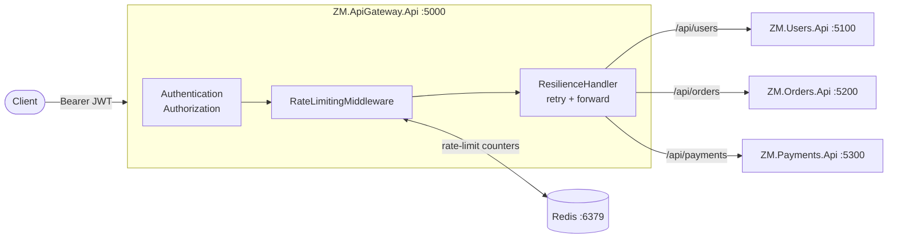

# ZM.ApiGateway

A production-style .NET 10 API Gateway built with [YARP](https://microsoft.github.io/reverse-proxy/) for a small microservices system.

The gateway centralizes cross-cutting concerns so the downstream APIs can remain simple:

- JWT authentication and route-level authorization
- Redis-backed distributed rate limiting
- Polly-based downstream resilience
- Per-route request timeouts
- Liveness and readiness health checks
- Structured logging and trace propagation
- Docker Compose and automated tests

> The project is designed as a portfolio/reference implementation focused on backend architecture, distributed systems, resilience, and testability.

---

## Architecture



The gateway forwards request paths unchanged. For example:

```text
GET /api/users/11111111-1111-1111-1111-111111111111
        ↓
GET /api/users/11111111-1111-1111-1111-111111111111
```

There is deliberately no YARP path transform. Keeping gateway and downstream paths identical makes the request flow easier to reason about and trace.

---

## Projects

| Project | Purpose |
|---|---|
| `ZM.ApiGateway.Api` | Gateway routing, authentication, authorization, rate limiting, resilience, timeouts and health checks |
| `ZM.Users.Api` | Users API with in-memory seed data |
| `ZM.Orders.Api` | Orders API with in-memory seed data |
| `ZM.Payments.Api` | Payments API with in-memory seed data |
| `ZM.ApiGateway.Api.UnitTests` | Unit tests for gateway middleware, policy resolution and resilience behavior |
| `ZM.ApiGateway.Api.IntegrationTests` | End-to-end gateway tests using `WebApplicationFactory` and Testcontainers Redis |

Rate limiting is implemented by the external `ZM.RateLimiter.Core` and `ZM.RateLimiter.Redis` packages, resolved from the local `packages/` folder through `NuGet.config`.

---

## Key Design Decisions

### YARP as the API Gateway

YARP handles route matching and forwarding while the gateway owns cross-cutting concerns such as authentication, authorization, rate limiting and resilience.

This keeps downstream services focused on their own API responsibilities instead of duplicating infrastructure concerns.

### Rate limiting at the gateway

Rate limiting is enforced before a request is forwarded. This protects downstream services and gives the gateway a single place to enforce client budgets.

Budgets are scoped by both client and YARP `RouteId`, so consuming the quota for one resource does not consume the quota for another.

### Transaction-free downstream forwarding

The gateway does not participate in business transactions owned by the services. It authenticates, authorizes, applies infrastructure policies, and forwards the request.

### Polly retries only for GET and HEAD

Automatic retries are intentionally limited to `GET` and `HEAD` requests. Retrying non-idempotent operations can duplicate side effects, and replaying request bodies introduces additional failure modes.

### Retries are below the rate limiter

The rate limiter runs before the YARP forwarding handler. A single client request consumes one rate-limit unit even if the downstream operation requires multiple retry attempts.

### Liveness vs readiness

Liveness answers whether the gateway process is alive. Readiness answers whether it can currently serve traffic. Redis is checked for readiness but not liveness so a Redis outage does not cause a healthy process to appear dead.

---

## Request Pipeline

The middleware order is intentional:

1. `UseHttpsRedirection`
2. `UseAuthentication`
3. `UseAuthorization`
4. `UseRequestTimeouts`
5. Local health endpoints
6. `MapReverseProxy`
7. `RateLimitingMiddleware`
8. YARP forwarder with Polly resilience

Rate limiting is inside the proxy pipeline because it needs the matched YARP route. This also means unauthenticated and unauthorized requests are rejected before consuming a rate-limit budget.

---

## Authentication and Authorization

Requests under `/api/**` require a JWT bearer token.

The gateway validates:

- issuer
- audience
- HMAC signing key
- token lifetime

### Claims

The current implementation uses the full ASP.NET claim URI values:

| Meaning | Claim type |
|---|---|
| Client id | `http://schemas.xmlsoap.org/ws/2005/05/identity/claims/nameidentifier` |
| Role | `http://schemas.microsoft.com/ws/2008/06/identity/claims/role` |

The client-id claim is also the identity used by the rate limiter.

### Authorization policies

| Route | Path | Policy | Accepted roles |
|---|---|---|---|
| `users-route` | `/api/users/**` | `user` | `user`, `admin` |
| `orders-route` | `/api/orders/**` | `user` | `user`, `admin` |
| `payments-route` | `/api/payments/**` | `admin` | `admin` |

Expected behavior:

| Situation | Response |
|---|---|
| Missing or malformed token | `401` |
| Valid token but insufficient role | `403` |

---

## Rate Limiting

### Client key resolution

The gateway resolves the rate-limit key in this order:

1. Client-id claim, when present
2. Otherwise the caller IP as `ip:{address}`
3. If neither is available, the request is rejected with `403`

Only IP-based keys receive the `ip:` prefix. Client ids remain compatible with `ClientPolicies` entries.

### Policy resolution

Policy selection follows this order:

1. `ClientPolicies[clientKey]`
2. `DefaultPolicy`, when configured
3. No policy → `403`
4. A client mapping that references an undefined policy → `403`

An invalid explicit mapping intentionally fails closed instead of silently falling back to the default policy.

### Scope

Rate-limit budgets are scoped by:

```text
client + route
```

For example, exhausting the `/api/users` budget does not exhaust the `/api/orders` budget for the same client.

### Response headers

| Header | When returned |
|---|---|
| `X-RateLimit-Limit` | Every metered response |
| `X-RateLimit-Remaining` | Every metered response |
| `Retry-After` | Rate-limit rejection |

### Rate-limit status codes

| Status | Meaning |
|---|---|
| `429` | Rate-limit budget exhausted |
| `403` | No applicable policy or caller cannot be identified |
| `503` | Rate-limiter infrastructure is unavailable |

---

## Resilience

Downstream forwarding runs through the keyed Polly pipeline `gateway-retry`.

| Setting | Value |
|---|---|
| Maximum retries | `2` |
| Total attempts | `3` |
| Initial delay | `200 ms` |
| Backoff | Exponential |
| Jitter | Enabled |
| Retry on | `HttpRequestException`, `502`, `503`, `504` |
| Methods | `GET`, `HEAD` |
| Per-route timeout | `30 s` |

Conceptually:

```text
GET /api/orders
      |
      v
   attempt 1
      |
   503 / network failure
      |
   retry + backoff
      |
   attempt 2
      |
   503 / network failure
      |
   retry + backoff
      |
   attempt 3
      |
   final response
```

Retries happen inside the forwarding layer and below rate limiting, so a retried downstream call is still charged once against the client's gateway quota.

---

## Health Checks

| Endpoint | Checks | Purpose |
|---|---|---|
| `/health/live` | None | Process liveness |
| `/health/ready` | Checks tagged `ready` (currently Redis) | Traffic readiness |

Both endpoints are local to the gateway and anonymous.

The liveness/readiness split prevents a dependency outage from being treated as a process failure.

---

## Failure Scenarios

| Failure | Gateway behavior |
|---|---|
| Invalid JWT | `401` |
| Missing required role | `403` |
| No rate-limit policy | `403` |
| Client cannot be identified | `403` |
| Rate-limit store unavailable | `503` |
| Rate limit exceeded | `429` |
| Downstream `502/503/504` on GET/HEAD | Retry according to Polly policy |
| Downstream network failure on GET/HEAD | Retry according to Polly policy |
| Retry budget exhausted | Return the final downstream outcome |
| Redis unavailable | Readiness fails; liveness remains independent |

---

## Downstream Services

Each service exposes collection and by-id endpoints.

Malformed ids do not match the `{id:guid}` route constraint, while an unknown valid GUID returns `404`.

| Service | Endpoints | Model |
|---|---|---|
| Users | `GET /api/users`, `GET /api/users/{id:guid}` | `User(Id, Name, Email)` |
| Orders | `GET /api/orders`, `GET /api/orders/{id:guid}` | `Order(Id, UserId, Status, Total, PlacedOn)` |
| Payments | `GET /api/payments`, `GET /api/payments/{id:guid}` | `Payment(Id, OrderId, Status, Amount, Method)` |

Seed data uses fixed, cross-linked identifiers so a user can be followed through an order and its payment.

---

## Running

### Docker Compose

Start the complete environment:

```bash
docker compose up -d
docker compose ps
```

| Service | Port |
|---|---:|
| Gateway | `5000` |
| Users | `5100` |
| Orders | `5200` |
| Payments | `5300` |
| Redis | `6379` |

All containers share the `proxybackend` network. The gateway reaches downstream services using their Docker Compose service names.

### Local development

Run each project with `dotnet run`. Redis is still required for rate limiting and readiness checks:

```bash
docker compose up -d redis
```

Typical local ports:

| Project | Port |
|---|---:|
| Gateway | `5247` |
| Users | `5064` |
| Orders | `5188` |
| Payments | `5169` |

Override environment-specific addresses through configuration, for example:

```bash
dotnet run --project ZM.ApiGateway.Api -- \
  --Redis:ConnectionString=localhost:6379 \
  --ReverseProxy:Clusters:users-cluster:Destinations:destination1:Address=http://localhost:5064
```

### Calling the gateway

```bash
curl http://localhost:5000/health/live
curl -H "Authorization: Bearer $TOKEN" http://localhost:5000/api/users
```

The token must use the configured issuer, audience, signing key, and claims.

---

## Configuration

The main gateway configuration lives in `ZM.ApiGateway.Api/appsettings.json`.

### JWT

| Setting | Purpose |
|---|---|
| `Issuer` | Expected `iss` claim |
| `Audience` | Expected `aud` claim |
| `SecretKey` | HMAC signing key |

### Redis

| Setting | Purpose |
|---|---|
| `ConnectionString` | StackExchange.Redis connection string |
| `Database` | Redis database index |
| `KeyPrefix` | Rate-limit key namespace |

### RateLimiting

| Setting | Purpose |
|---|---|
| `DefaultPolicy` | Policy for clients without an explicit mapping |
| `Policies` | Named rate-limit policies and their algorithms/limits/windows |
| `ClientPolicies` | Client id → policy name mapping |

Example:

```json
"RateLimiting": {
  "DefaultPolicy": "free",
  "Policies": {
    "free": {
      "Algorithm": "FixedWindow",
      "Limit": 60,
      "Window": "00:01:00"
    },
    "pro": {
      "Algorithm": "SlidingWindow",
      "Limit": 1000,
      "Window": "00:01:00"
    }
  },
  "ClientPolicies": {
    "demo-pro-client": "pro"
  }
}
```

### ReverseProxy

Standard YARP route/cluster configuration.

Each route defines a `ClusterId`, `AuthorizationPolicy`, `Timeout`, and path match. Each cluster defines its destination address.

There is deliberately no `Transforms` section because gateway and service paths are kept identical.

---

## Testing

Run the full test suite with:

```bash
dotnet test ZM.ApiGateway.slnx
```

### Unit tests

Unit tests cover gateway behavior without external dependencies, including:

- rate limiting: allowed, denied, no policy, limiter failure and identity fallback
- configuration policy resolution
- resilience handler behavior

### Integration tests

Integration tests boot the real gateway with `WebApplicationFactory` and use Docker/Testcontainers for Redis.

The downstream HTTP client is replaced with a controllable stub factory, allowing tests to simulate downstream failures while keeping gateway routing, authentication, authorization, rate limiting, and the configured resilience pipeline active.

Important scenarios include:

- authenticated requests are forwarded
- authentication and authorization failures are returned correctly
- clients without policies are rejected
- rate limits are enforced
- different clients have independent budgets
- different routes have independent budgets
- rate-limiter failures return `503`
- downstream resilience can be exercised independently from the real network

---

## Project Structure

A simplified view:

```text
ZM.ApiGateway/
├── src/
├── tests/
├── packages/
├── docs/
├── docker-compose.yml
├── NuGet.config
└── README.md
```

The implementation keeps gateway-specific infrastructure separate from the reusable rate-limiter packages.

---

## What This Project Demonstrates

This project focuses on practical backend engineering rather than a large feature surface.

It demonstrates:

- ASP.NET Core middleware and dependency injection
- YARP reverse-proxy customization
- JWT authentication and policy-based authorization
- Distributed rate limiting with Redis
- Polly-based downstream resilience
- Request timeout handling
- Liveness/readiness health checks
- Structured logging and trace propagation
- Unit and integration testing
- Testcontainers for infrastructure-backed tests
- Docker Compose for local environments
- separation between reusable packages and gateway-specific infrastructure

The main goal is to show how these concerns fit together and how failure behavior is handled at the system boundary.

---

## License

Add the repository's chosen license here if the project is intended for public reuse.
